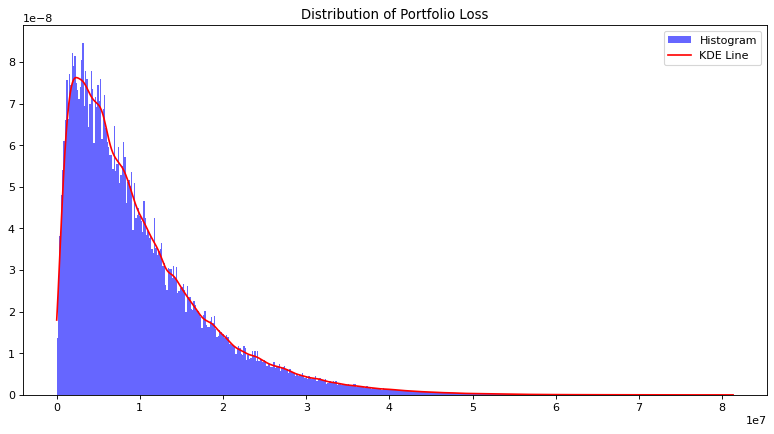

# Illustration of the expected and unexpected losses under the Vasicek-Merton model

**Author: Juan Pablo Conejero Herrera**

The purpose of this notebook is to illustrate the concepts of expected loss (EL) and unexpected loss (UL) in the context of credit risk management. To this end, a Vasicek-Merton model is introduced and a Monte Carlo simulation is carried out to empirically derive the EL and UL of a credit portfolio.

Specifically, the following topics will be covered in this notebook:
- Modelisation of the probability of default ($PD$) considering both external (systemic) and loan/obligor specific (idiosyncratic) factors.
- Equivalence of the EL to the mean of the loss distribution.
- Equivalence of the UL to the 99.9-th quantile of the loss distribution. 

## Introduction

There are two key measures of the credit risk of a financial instrumnent: the EL and the UL. As it name suggests, the EL relates to the financial loss that could be expected on average while the UL deals with the financial loss that would take place in an extreme (hence unexpected) scenario.

There are several ways of modelling the EL and UL. In this notebook, we introduce one of the most popular, the **Vasicek-Merton model**, which is used by the Basel Committee on Banking Supervision to determine the amount of capital that banks are required to hold against credit risk. Under this framework, the EL and UL are defined as

$$EL = PD\cdot LGD \cdot EAD$$
$$UL = \Phi\left(\Phi^{-1}(PD) + \sqrt{\rho} \cdot \Phi^{-1}(99.9\%)\right)\cdot EAD \cdot LGD  $$

where $\Phi$ is the cumulative standard normal distribution, $\rho$ is the common loan/obligor correlation, $PD$ is the probability of default, $LGD$ the severity and $EAD$ the exposure at default. Notice that the expression for UL does not include a maturity adjustment. This is a consequence of using a simplified model and does not hamper our goal of illustrating the EL and UL by means of a simulation.


```python
# import libraries
import scipy.stats as sps
import matplotlib.pyplot as plt
import numpy as np
```

## Vasicek-Merton model

The are several variants of the Vasicek-Merton model depending on the assumptions made. In this notebook, we will assume the following:
- Homogeneous portfolio in terms of $LGD$ (severity) and $EAD$ (exposure).
- Constant loan/obligor correlation, $\rho$.
- Common default threshold, $T$ for all obligors.

We start by considering the following **one-factor Gaussian copula**:
$$V_n=\sqrt{\rho}y + \sqrt{1-\rho}\epsilon_n$$
where $y\sim N(0,1)$ is the systemic factor that affects all loans/obligor equally and $\epsilon_n \sim N(0,1)$ is the idiosyncratic factor particular to the loan/obligor $n$.

Under the Vasicek-Merton model, a loan/obligor defaults when $V_n$ falls below a certain threshold, $T$. It is useful to see $V_n$ as the value of a firm and $T$ as the threshold below which the value of the firm is smaller than the value of the loan (negative equity) and, hence, it is preferable to default than to repay the loan. Moreover, the systemic factor $y$ can be thought of as economic conditions that affects all loans/obligors simultaneously, while the idiosyncratic factor $\epsilon_n$ as all other circumstances that are unique to loan/obligor $n$ and that affect their ability to repay the loan.  


The probability of default of loan/obligor $n$ conditional to a realisation of $y=y_0$ is

$$PD(y_0)=P\left[V_n<T|y=y_0\right] = P\left[\sqrt{\rho}y_0 + \sqrt{1-\rho}\epsilon_n<T|y=y_0\right] = P\left[\epsilon_n < \frac{T-\sqrt{\rho}y_0}{\sqrt{1-\rho}}|y=y_0\right] = \Phi\left(\frac{T-\sqrt{\rho}y_0}{\sqrt{1-\rho}}| y=y_0\right)$$

where $\Phi()$ is the cumulative standard normal distribution. The value of the threshold is a constant that can be set arbitrarily. In our case, we will derive an expression to find the value of the threshold that makes the expected value of the probability of default equal to an arbitrary value, $PD_{mean}$.

$$E[PD(y)] = \int_{-\infty}^{\infty} PD(y) \cdot p(y) \;\; dy = \int_{-\infty}^{\infty} \Phi\left(\frac{T-\sqrt{\rho}y}{\sqrt{1-\rho}}\right) \cdot p(y) \;\; dy = \int_{-\infty}^{\infty} \Phi\left(\frac{T}{\sqrt{1-\rho}} - \frac{\sqrt{\rho}}{\sqrt{1-\rho}}y\right) \cdot p(y) \;\; dy$$  

This expression can be simplified by considering the identity $\int_{-\infty}^{\infty}\Phi(a+bx)\cdot p(x)\;\; dx=\Phi\left(\frac{a}{\sqrt{1+b^2}}\right)$.

$$E[PD(y)] = \int_{-\infty}^{\infty} \Phi\left(\frac{T}{\sqrt{1-\rho}} - \frac{\sqrt{\rho}}{\sqrt{1-\rho}}y\right) \cdot p(y) \;\; dy = \Phi\left(\frac{\frac{T}{\sqrt{1-\rho}}}{\sqrt{1+\frac{\rho}{1-\rho}}} \right) = \Phi(T) $$ 

Thus, 
$$T = \Phi^{-1}(E[PD(y)]) $$

Once we have introduced the Vasicek-Merton model, we are ready to carry out a Monte Carlo simulation to derive the empirical distribution of a portfolio of loans that satisfies the assumptions that we have imposed.

## Monte Carlo simulation

Let's first define the inputs.


```python
# inputs

# risk parameters
pd_mean = 0.1 # average PD of the loans/obligors
lgd = 1 # assumed fixed without loss of generality
ead = 1000

# asset/obligor correlation
rho = 0.2
```

From the expression derived before, we derive the threshold.


```python
threshold = sps.norm.ppf(pd_mean)
```

Now, it is time to draw our sample of loans/obligors. In terms of the Vasicek-Merton model, this corresponds to generating the idiosyncratic factor specific to each loan/obligor.  


```python
# sample size (number of loans/obligors)
n = 10**5

# idiosyncratic factors (N(0,1) by assumption)
idiosync_factors = np.random.normal(0, 1, n)
```

Once we have generated our portfolio, we obtain the loss distribution under a variety (random) of systemic conditions. To this end, we generate a total of $t$ systemic factors (or macroeconomic conditions) and evaluate the number of defaults in each of these scenarios according to the Vasicek-Merton model introduced earlier.


```python
%%time

# number of simulations (number of different economic scenarios that will be considered)
t = 10**6

# portfolio loss vector (store total loss for each year)
loss = np.zeros(t)

# pre-compute constants (enhances efficiency)
sqrt_rho = rho**0.5
sqrt_1_minus_rho = (1 - rho)**0.5

for i in range(t):
    
    # print simulation progress
    if (i + 1) % (t/10) == 0:
        print('Progress: {:2.0%}'.format((i + 1)/t))
    
    # systemic factor (economic conditions; N(0,1) by assumption)
    systemic_factor = np.random.normal(0, 1)
        
    # one-factor model
    v = sqrt_rho * systemic_factor + sqrt_1_minus_rho * idiosync_factors
         
    # count defaults
    defaults = np.sum(v < threshold) 
        
    # compute yearly loss (since identical loans / obligors)
    loss[i] = defaults * ead * lgd
```

    Progress: 10%
    Progress: 20%
    Progress: 30%
    Progress: 40%
    Progress: 50%
    Progress: 60%
    Progress: 70%
    Progress: 80%
    Progress: 90%
    Progress: 100%
    CPU times: total: 4min 32s
    Wall time: 4min 38s
    

Let's graph the empirical loss distribution of the portfolio.


```python
# Convert to numpy array (already done in your code)
loss_np = np.array(loss)

# Resize the graph
plt.figure(figsize=(12, 6), dpi=80)

# Plot histogram of losses
plt.hist(loss_np, bins=500, density=True, alpha=0.6, color='b', label="Histogram")

# Add smooth line using KDE
kde = sps.gaussian_kde(loss_np)
x_vals = np.linspace(loss_np.min(), loss_np.max(), 1000)
kde_vals = kde(x_vals)
plt.plot(x_vals, kde_vals, color='red', label="KDE Line")

# Add title and legend
plt.title("Distribution of Portfolio Loss")
plt.legend()
plt.show()
```


    

    


## Results

Let's compare the EL with the average loss obtained in our simulation.


```python
# expected loss of the portfolio 
EL = n * (ead * pd_mean * lgd)
print("Expected loss of portfolio: {}".format(EL))

# average loss per asset/obligor
average_loss = np.mean(loss)
print("Average loss of portfolio: {}".format(average_loss))

# discrepancy
print("Relative difference: {}%".format(abs(EL-average_loss)/EL*100))
```

    Expected loss of portfolio: 10000000.0
    Average loss of portfolio: 10003133.106
    Relative difference: 0.03133106000000611%
    

Finally, less compare the UL to the 99.9th percentile of the loss distribution.


```python
# UL (as defined under Basel III without maturity adjustment)
UL = sps.norm.cdf(sps.norm.ppf(pd_mean) + rho**0.5 * sps.norm.ppf(0.999)) * ead * lgd * n
print("Unexpected loss of portfolio: {}".format(UL))

# 99.9th percentile 
empir_ul = np.percentile(loss_np, 99.9)
print("99.9th percentile loss of portfolio: is {}".format(empir_ul))

# discrepancy
print("Relative difference: {}%".format(abs(UL-empir_ul)/UL*100))
```

    Unexpected loss of portfolio: 54000341.94037084
    99.9th percentile loss of portfolio: is 54359006.00000098
    Relative difference: 0.6641884972250558%
    

Both the average and the 99.9th percentile of the loss distribution converge to the EL and UL, respectively. 
